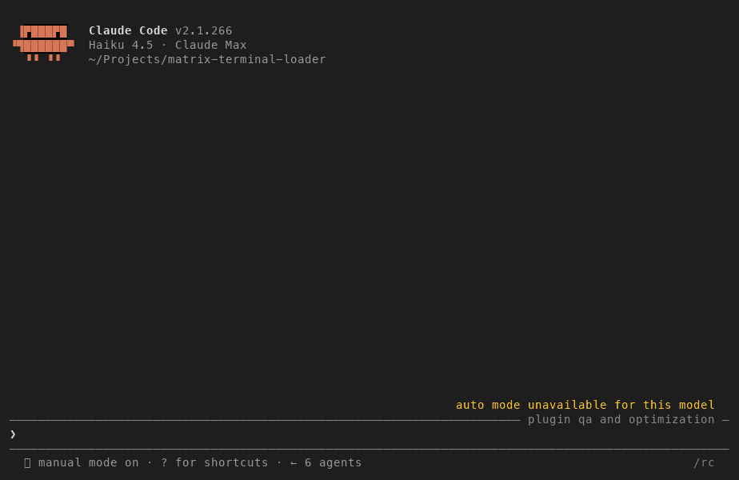

# matrix-terminal-loader

A [Claude Code](https://code.claude.com) plugin that fills your terminal with Matrix-style digital rain while Claude is thinking. Claude's own interface, its progress messages, and its streamed reply show through the rain where they normally appear, the prompt box at the bottom stays clean so you can type your next prompt, and when Claude finishes the rain drains off the screen and the transcript is restored.



The recording is a real session, made by [`scripts/record-demo.py`](scripts/record-demo.py). The actual `claude` binary was run with `--plugin-dir` inside a 100x32 pseudo-terminal, every byte it and the plugin wrote was fed through a terminal emulator, and the screen was snapshotted every 90 ms. Nothing is mocked. The prompt-typing part is sampled more sparsely than the rain so the recording gets to the point.

## What you get

- **Digital rain** in true-color green: streams of half-width katakana, digits, and hex letters with a bright head and a fading trail, at 20 frames per second, dense from the first frame.
- **Coexistence, not takeover.** The rain draws in every other column and erases only its own fading trails, so Claude Code's interface, its messages and its streamed answer, shows through and scrolls exactly where it always does. This is deliberately the simplest and most robust behavior (see the note below).
- **A clean prompt box.** The bottom six rows of the terminal, where Claude Code draws its input box, borders, and status line, are never touched by the rain, so a prompt you type while Claude is still working stays readable. The band is adjustable (see Settings).
- **A graceful wind-down.** When Claude finishes, no new streams start. The ones in flight fall off the bottom and fade, then the terminal is restored with the complete reply in place.
- **Careful teardown.** The animation runs in a detached background process that cleans itself up on every exit path: the Stop hook, a crash, Ctrl+C, the terminal closing, or the session ending without a Stop hook at all.
- **One rain per terminal.** Several Claude Code sessions in different windows each get their own rain, and stopping one never touches another.
- **An optional overlay.** If you would rather the plugin draw Claude's progress as its own formatted bullets and show a Matrix-themed status verb instead of letting Claude's UI bleed through, that mode exists as a setting. It is off by default because it fights Claude Code's own rendering (again, see the note).

### A note on the shared screen

Claude Code 2.1 is a full-screen terminal application: it owns the screen and repaints it continuously. A plugin cannot get a private surface to composite onto, so any animation shares that one screen. This plugin embraces that: it lets Claude's interface show through the rain rather than trying to paint over it. The trade-off is that Claude's own spinner verb (for example "Philosophizing…") is visible too, and the rain nibbles characters out of Claude's text in the columns it occupies, outside the protected band at the bottom. The opt-in overlay tries to suppress Claude's UI and show its own, but under heavy streaming output the two repaint loops fight and flicker, which is why it is not the default.

## How it works

Claude Code exposes lifecycle [hooks](https://code.claude.com/docs/en/hooks). This plugin registers two of them in `.claude-plugin/plugin.json`:

| Hook event         | Fires when                   | What the plugin does                                              |
| ------------------ | ---------------------------- | ----------------------------------------------------------------- |
| `UserPromptSubmit` | You press Enter on a prompt  | `node index.js --start` launches the rain in a background process |
| `Stop`             | Claude finishes its response | `node index.js --stop` winds the rain down and restores the screen |

Several details of Claude Code's hook runner shape the design:

1. **Hooks block Claude Code until they exit.** The start hook therefore never animates itself. It spawns a detached background process (`node index.js --run`), writes that process's PID to a lock file, and exits in well under 100 ms.
2. **Hook output is captured, not shown.** Claude Code parses a hook's stdout as JSON and runs hooks in their own session with no controlling terminal, so `/dev/tty` is unavailable and printing escape codes does nothing. Instead, the start hook finds the terminal device of its parent process (Claude Code itself), such as `/dev/ttys005` on macOS or `/dev/pts/3` on Linux, and the background process opens that device by path and draws on it directly. On Linux the device comes from `/proc`, elsewhere from `ps`. The terminal size is read with the kernel's window-size query through a throwaway handle on the same device (with `stty` as a fallback), and polled twice a second so window resizes are picked up without a single fork.
3. **The rain coexists instead of repainting.** Each frame is drawn incrementally: new stream glyphs and the erasure of the plugin's own faded trails, nothing else. Every cell the plugin is not actively lighting is left to Claude Code, so its output stays on screen, and the bottom rows are never lit at all. Each frame is written to the terminal in a single blocking write, so Claude Code's concurrent output can only land between frames, never inside one of the plugin's escape sequences.
4. **The stop hook is graceful.** It sends `SIGUSR1` to the rain process, which stops spawning streams and lets the rest fall, then exits once the screen is dark or the wind-down budget runs out. Only then does the stop hook restore the terminal and send a one-column resize nudge, which Claude Code repaints its transcript in response to, so the finished reply is back in place. The hook's timeout is set generously to allow for this.
5. **Progress messages, in the optional overlay, come from the transcript.** The hook input includes the path of the session's transcript file. When the overlay is enabled the rain process tails it and turns each new assistant text block or tool call into a one-line bullet. Claude Code documents this file as internal and subject to change, so the parser is defensive: anything it does not recognize is ignored and the rain carries on.

### Teardown and cleanup

The background process is written to never linger and never leave the terminal in a bad state. It shuts down and restores the cursor and colors on:

- the Stop hook (graceful wind-down), a `SIGTERM`/`SIGINT`/`SIGHUP`, or an uncaught error;
- the Claude Code process that started it going away (checked twice a second), so a crash, a `Ctrl+C`, or a session that ends without ever firing the Stop hook still cleans up within about a second;
- the terminal device disappearing (a closed window), detected as a failed write;
- a 15-minute hard cap, in case no Stop hook ever arrives.

Every timer is tracked and cleared on exit, the lock file is removed, and a final `process.on('exit')` handler restores the terminal as a last resort.

The lock file is one per terminal, `matrix-terminal-loader-<device>.lock` in the system temp directory, so nothing is ever written into the plugin's own folder. A second `--start` on a terminal that already has a rain is a no-op. A stale lock whose PID has since been recycled by some unrelated process is recognized as stale (the command line is checked) and neither blocks a new rain nor gets that process signalled by the stop hook.

Colors are 24-bit (`COLORTERM=truecolor` or `24bit`), so the green is the same in every terminal theme. Terminals without true color get the nearest entries from the 256-color palette. The basic ANSI green was deliberately avoided because many themes remap it to olive or yellow.

## Requirements

- Claude Code 2.1 or newer with plugin support.
- Node.js 18 or newer on your `PATH` as `node`.
- macOS or Linux. Windows has no terminal device path to write to, so the hooks exit quietly and Claude Code behaves as if the plugin were not installed.
- A terminal font with half-width katakana (U+FF66 to U+FF9D). Most terminals fall back to a system CJK font automatically.

Exercised by hand on macOS with Node 22 and Claude Code 2.1.266, in both interactive and `claude -p` sessions, including the finished reply being restored after the rain and all the teardown paths above. The automated test suite runs in GitHub Actions on Ubuntu and macOS with Node 18, 20, and 22.

## Installation

### Try it for one session

```bash
git clone https://github.com/solepixel/matrix-terminal-loader.git
claude --plugin-dir ./matrix-terminal-loader
```

`--plugin-dir` loads the plugin for that session only. Type any prompt and the rain starts.

### Make it permanent with a shell alias

```bash
# ~/.zshrc or ~/.bashrc
alias claude='claude --plugin-dir "$HOME/path/to/matrix-terminal-loader"'
```

### Install through this repo's marketplace

This repository is its own plugin marketplace:

```
/plugin marketplace add solepixel/matrix-terminal-loader
/plugin install matrix-terminal-loader@solepixel
```

`solepixel` is the marketplace name declared in `.claude-plugin/marketplace.json`. The same works on the command line with `claude plugin marketplace add` and `claude plugin install`.

## Usage

There is nothing to configure. Submit a prompt, watch the rain, and the screen is restored when Claude finishes. Typing your next prompt while the rain falls is fine: the input box at the bottom is never drawn over.

To see the animation outside Claude Code, run it directly in any terminal and press Ctrl+C to stop:

```bash
node index.js --run
```

## Settings

Everything can be left at its default. Settings are read in this order, later sources winning:

1. Built-in defaults at the top of `index.js`.
2. `~/.claude/matrix-terminal-loader.json` for all your projects.
3. `<project>/.claude/matrix-terminal-loader.json` for one project.
4. Plugin options, which Claude Code collects in a dialog when the plugin is installed from a marketplace and passes to the hooks as `CLAUDE_PLUGIN_OPTION_*` environment variables.
5. Environment variables `MATRIX_MESSAGES`, `MATRIX_STATUS`, `MATRIX_WIND_DOWN_MS`, and `MATRIX_KEEP_BOTTOM_ROWS`.

### Plugin options

| Option             | Default | Meaning                                                                                                     |
| ------------------ | ------- | ----------------------------------------------------------------------------------------------------------- |
| `show_messages`    | `false` | Turn on the overlay: draw Claude's progress as formatted bullets instead of letting its own text bleed through |
| `message_lines`    | `40`    | How many recent messages the overlay keeps as they scroll                                                   |
| `show_status`      | `false` | Turn on the Matrix status line with a held verb                                                             |
| `status_verbs`     | empty   | Custom status phrases separated by `\|`, for example `Jacking in\|Bending spoons`                           |
| `keep_bottom_rows` | `6`     | Rows at the bottom the rain never touches, so the prompt box and status line stay clean. Raise it if your prompt box sits higher (extra notice lines, long multi-line prompts); `0` lets the rain reach the bottom |
| `wind_down_ms`     | `4000`  | Longest the rain may take to drain after Claude finishes, capped at 15000 so the Stop hook never times out  |

Change them later with `/plugin configure matrix-terminal-loader@solepixel` inside Claude Code, or `claude plugin install ... --config key=value`.

### JSON file

The JSON file accepts any subset of the built-in defaults, and nested objects are merged. The visual keys are `frameMs`, `columnSpacing`, `keepBottomRows`, `spawnChance`, `decayPerFrame`, `flickerChance`, `speeds`, `windDownMaxMs`, `maxRunMs`, `chars`, and `colors` (RGB triples for `head`, the `trail` bands, `text`, `bullet`, and `status`). The `messages` and `status` objects control the opt-in overlay. `alternateScreen` (default `false`) switches the rain to the alternate screen buffer, only useful for a future Claude Code that is not itself full-screen. Values that would make the rain undrawable (a zero column spacing, an empty glyph set, a wind-down longer than the hook timeout) are clamped.

### Environment variables

`MATRIX_MESSAGES=1` and `MATRIX_STATUS=1` turn the overlay and status line on for one launch (and `=0` off). `MATRIX_WIND_DOWN_MS=0` makes the stop instant. `MATRIX_KEEP_BOTTOM_ROWS=8` widens the protected band. `MATRIX_DEBUG=/path/to/log` writes a timestamped log of what the hooks did. `MATRIX_TTY=/dev/ttys005` points the plugin at a specific terminal instead of the one it finds by itself, which is how the tests drive it.

## Testing

```bash
npm test
```

The suite uses Node's built-in test runner and has no dependencies. Unit tests cover the settings merge and precedence, the 256-color fallback, text measurement and truncation, the transcript parser, the renderer (which cells it writes, that it never touches the protected band, that overlay cells are redrawn and erased correctly), and the overlay layout. Integration tests open a real pseudo-terminal (through `python3`, which macOS and Linux ship) and run the actual `--start`, `--run`, and `--stop` modes against it: they check the hook exits fast and prints nothing, the lock file, that only rain columns above the prompt box are written, the graceful stop and repaint nudge, two terminals with independent rains, a stale lock with a recycled PID, teardown on parent death and on each signal and on a closed terminal, the hard run cap and project config file, the overlay, and window-size reading and resizing. The last test cross-checks `plugin.json`, `marketplace.json`, `package.json`, and `CHANGELOG.md` against each other and runs `claude plugin validate --strict` when the CLI is installed. Without `python3` the pty-backed tests are skipped, not failed.

```bash
claude plugin validate . --strict
```

`--strict` turns warnings into errors. Both the plugin manifest and the marketplace manifest pass cleanly.

## Publishing

This repo is both the plugin and its own marketplace (`.claude-plugin/marketplace.json` lists the plugin with `source: "."`), so pushing it to GitHub makes it installable with the two commands above. Bump the `version` in `plugin.json`, `marketplace.json`, and `package.json` on each release (a test enforces that they match and that `CHANGELOG.md` has an entry), tag the commit, and add the changelog entry. To refresh the demo, run `python3 scripts/record-demo.py` (needs `pyte`, `Pillow`, and `fontTools`, plus the `claude` CLI). Claude Code also has an Anthropic-run plugin directory for discovery; follow the current "submit your plugin" instructions in the official [plugins documentation](https://code.claude.com/docs/en/plugins), which expects a passing `claude plugin validate --strict`, a clear README, a `LICENSE`, and a real `version`, all of which this repo has.

## Troubleshooting

**Nothing happens when I submit a prompt.**
Run with a debug log and read it after a prompt:

```bash
MATRIX_DEBUG=/tmp/matrix.log claude --plugin-dir ./matrix-terminal-loader
cat /tmp/matrix.log
```

A healthy run logs `start: tty=/dev/...`, then `run: tty=/dev/... size=WxH truecolor=true ...`, then `run: winding down`, then `stop: repaint nudge sent`. If `tty=null`, Claude Code is not attached to a terminal (for example when driven over a pipe) and the plugin stands down on purpose.

**The rain is yellow or the wrong green.**
Your terminal is not advertising true color, so the plugin fell back to the 256-color palette, which some themes remap. Set `COLORTERM=truecolor` in your shell profile if your terminal supports it.

**The rain covers my prompt box, or stops too far above it.**
Adjust `keep_bottom_rows` (or `MATRIX_KEEP_BOTTOM_ROWS`). Six rows suits Claude Code 2.1's default layout; a permanent notice line above the status bar needs one more.

**The rain is still running after Claude stopped.**
The Stop hook did not fire, usually because the session ended abruptly. The background process notices its parent is gone within a second and exits. If one ever survives:

```bash
pkill -f "index.js --run"
rm -f "${TMPDIR:-/tmp}"/matrix-terminal-loader-*.lock
```

**The cursor is missing or the screen looks wrong afterwards.**
Run `node index.js --stop` from the plugin directory, or `reset` in that terminal, then resize the window slightly so Claude Code repaints.

## Known limitations

- **Claude Code and the rain share one screen.** By design the plugin lets Claude's interface show through, so Claude's own spinner verb is visible and the rain erodes characters from Claude's text in the columns it occupies. This is inherent to drawing over a live full-screen application and cannot be fully removed from a plugin.
- **The protected band is a fixed height.** The plugin cannot see where Claude Code draws its prompt box, so it keeps a fixed number of bottom rows clear. A very long multi-line prompt typed during the rain can grow past the band.
- **The optional overlay flickers under load.** With `show_messages`/`show_status` on, the plugin and Claude Code both repaint and can fight, especially while Claude streams a long answer.
- **The reply is restored by a resize.** If a future Claude Code release stops re-rendering on size changes, the reply could be missing from the screen after the rain. Resizing the window or pressing Enter on an empty prompt brings it back.
- **The transcript format is internal to Claude Code.** The overlay's progress bullets depend on it; a format change would cost the bullets, not the rain.
- **Permission prompts are not covered.** The rain runs from prompt submit until Claude's final Stop. If Claude pauses to ask for tool permission, the rain keeps falling above the prompt box until you answer.

## Project layout

```
matrix-terminal-loader/
├── .claude-plugin/
│   ├── plugin.json         # manifest: name, version, author, hook registrations, settings
│   └── marketplace.json    # catalog so the repo is its own installable marketplace
├── .github/workflows/
│   └── test.yml            # runs the suite on Ubuntu and macOS, Node 18/20/22
├── assets/
│   └── demo.gif            # the recording shown above
├── scripts/
│   └── record-demo.py      # records demo.gif from a real Claude Code session
├── test/
│   ├── unit.test.js        # settings, colors, text, transcript, renderer, overlay
│   ├── integration.test.js # start/run/stop against a real pseudo-terminal
│   └── helpers/            # the pty holder used by the integration tests
├── index.js                # --start / --stop hook entry points and the --run animation loop
├── package.json            # `npm test`; no dependencies
├── CHANGELOG.md
├── LICENSE                 # MIT
└── README.md
```

## Credits

Original animation and concept generated with Gemini. Hook wiring, terminal-device discovery, process lifecycle and cleanup, the rain renderer, the test suite, and testing inside Claude Code by Claude.
